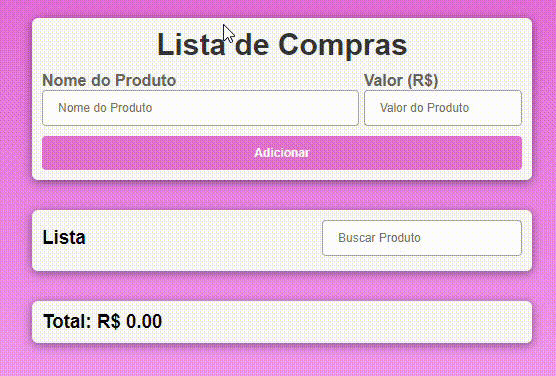

# ı́ndıce

[Projeto- Criando um sistema de lista de compras](#projeto---criando-lista-de-compra)  
[Descrição](#descri%C3%A7%C3%A3o)  
[Introdução](#introdu%C3%A7%C3%A3o)  
[Funcionalidades](#funcionalidades)  
[Tecnologia utilizada](#tecnologia-utilizadas)  
[Fontes consultadas](#fontes-consultadas)  
[Autores](#autores)  

# Projeto lista 🚀 - criando um sistemema de lista de compras

![image info]) 

## Descrição📝
O Projeto de Lista de compras é uma das melhores ferramentas para os usuarios, tem o intuito de ajudar o cliente a buscar e somar suas compras 

## Introdução📌
Ferramenta que auxilia os usuarios com sua lista de compra  
O site foi criado para facilitar e ajudar os usuario com sua lista de compra de uma forma pratica e fácil 

## Funcionalidades ⚙️
Ao acessar o site o usuário sera direcionado para a página inicial, lá ira aparecer as funções, sendo elas: 
  - `Nome do produto`: O usuário terá que colocar o nome do produto desejado  
 -  `Valor`: Esse campo será utilizado para adiconar o valor do produto  
  - `Lista`: Caso o usuario queira rever o valor do produto, só digitar pelo o nome que logo irá aparecer 
  - `Total`: Irá somar o valor de sua lista de compras por completo

  

 ### Tecnologia utilizadas ⌨️ 
* Html
* Array
* style
* github

## Fontes consultadas 🛠️
[gzmel] https://github.com/gzmael/lista-compras

## Autores ✒️
[veronica] https://github.com/veronicarodrigues07/projeto-array  

